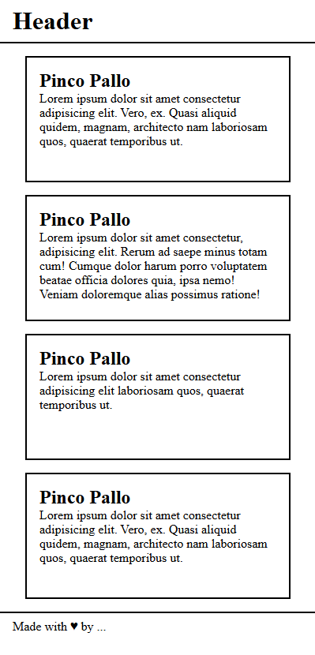

# HTML-CSS Wireframe

HTML-CSS page for mobile layout

# Demo Live
[**Click here for demo**](https://daviderocco85.github.io/htmlcss-wireframe/)

# Target Exercise

Recreate an html-css page that reproduces a mobile layout

# Notes
I opted for a box shadow border instead of a dashed border, as it provides a more mobile-oriented layout aesthetic.

# Wireframe Exercise Example

